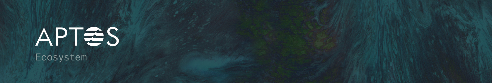

# **Aptos Ecosystem**

A collection of live projects within the Aptos ecosystem.

- [Project Categories](#project-categories)
    - [DeFi](#defi)
    - [Infra](#infra)
    - [Marketplace](#marketplace)
    - [NFT Tooling](#nft-tooling)
    - [Stablecoins](#stablecoins)
    - [Tooling](#tooling)
    - [Wallets](#wallets)
- [Contribution Guidelines](#contribution-guidelines)

---

# Project Categories

## DeFi
- AnimeSwap - [Github](https://reactjs.org/) | [Twitter](https://twitter.com/animeswap_org)
- Argo - [Twitter](https://twitter.com/ArgoUSD) | [Website](https://argo.fi/)
- Aries Markets - [Twitter](https://twitter.com/AriesMarkets) | [Website](https://ariesmarkets.xyz/)
- AUX - [Github](https://github.com/aux-exchange) | [Twitter](https://twitter.com/AuxExchange) | [Website](https://aux.exchange/)
- Blocto - [Github](https://github.com/portto) | [Twitter](https://twitter.com/BloctoApp) | [Website](https://token.blocto.app/)
- Ditto - [Twitter](https://twitter.com/Ditto_Finance) | [Website](https://www.dittofinance.io/)
- HoustonSwap - [Twitter](https://twitter.com/Houston_swap) | [Website](https://houstonswap.io/)
- PancakeSwap - [Github](https://github.com/pancakeswap/) | [Twitter](https://twitter.com/pancakeswap) | [Website](https://aptos.pancakeswap.finance/swap)
- Pontem Network - [Github](https://github.com/pontem-network) | [Twitter](https://twitter.com/PontemNetwork) | [Website](https://pontem.network/)
- Snotra - [Github](https://github.com/SnotraTech) | [Twitter](https://twitter.com/SnotraQ) | [Website](https://snotra.tech)
- Superposition - [Twitter](https://twitter.com/SuperpositionFi) | [Website](https://www.superposition.finance/)
- Thala Labs - [Twitter](https://twitter.com/ThalaLabs) | [Website](https://www.thalalabs.xyz/)
- Tortuga - [Twitter](https://twitter.com/TortugaFinance) | [Website](https://tortuga.finance/)
- Umi - [Github](https://github.com/umi-ag) | [Twitter](https://twitter.com/umi_protocol) | [Website](https://umi.ag)

## Infra
- Chainbase - [Github](https://github.com/chainbase-labs) | [Twitter](https://twitter.com/ChainbaseOnline) | [Website](https://chainbase.online/)
- Crust - [Github](https://github.com/crustio) | [Twitter](https://twitter.com/CrustNetwork) | [Website](https://crust.network/)
- Mokshya Protocol - [Github](https://github.com/mokshyaprotocol) | [Twitter](https://twitter.com/MokshyaProtocol) | [Website](https://mokshya.io/)
- NodeReal - [Github](https://github.com/node-real)| [Twitter](https://twitter.com/Nodereal_io) | [Website](https://nodereal.io/)
- Pyth Network - [Github](https://github.com/pyth-network) | [Twitter](https://twitter.com/PythNetwork) | [Website](https://pyth.network/)
- Switchboard - [Github](https://github.com/switchboard-xyz) | [Twitter](https://twitter.com/switchboardxyz) | [Website](https://switchboard.xyz/)
- Wormhole - [Github](https://github.com/wormhole-foundation/wormhole) | [Twitter](https://twitter.com/wormholecrypto) | [Website](https://wormhole.com/)
- ZettaBlock - [Twitter](https://twitter.com/ZettaBlockHQ) | [Website](https://www.zettablock.com/)

## Marketplace
- BlueMove - [Twitter](https://twitter.com/BlueMove_OA) | [Website](https://bluemove.net/)
- Mojito Markets - [Twitter](https://twitter.com/MojitoMarkets) | [Website](https://mojitomarkets.exchange/)
- Souffl3 - [Twitter](https://twitter.com/nft_souffl3) | [Website](https://souffl3.com/)
- Topaz - [Twitter](https://mobile.twitter.com/topazmarket) | [Website](https://www.topaz.so/)

## NFT Tooling
- Blocto - [Github](https://github.com/portto) | [Twitter](https://twitter.com/BloctoApp) | [Website](https://token.blocto.app/)
- Mokshya Protocol - [Github](https://github.com/mokshyaprotocol) | [Twitter](https://twitter.com/MokshyaProtocol) | [Website](https://mokshya.io/)
- Souffl3 - [Twitter](https://twitter.com/nft_souffl3) | [Website](https://souffl3.com/)
- Topaz - [Twitter](https://mobile.twitter.com/topazmarket) | [Website](https://www.topaz.so/)

## Stablecoins
- Argo - [Twitter](https://twitter.com/ArgoUSD) | [Website](https://argo.fi/)
- Thala Labs - [Twitter](https://twitter.com/ThalaLabs) | [Website](https://www.thalalabs.xyz/)
    
## Tooling
- Aptos Name Service - [Twitter](https://twitter.com/aptosnames)
- AptosFaucet - [Github](https://github.com/tolgaand/aptosfaucet) | [Website](https://www.aptosfaucet.com)
- AptosPassport - [Github](https://github.com/aptospassport) | [Twitter](https://twitter.com/aptospassport) | [Website](https://aptpp.com/)
- AptStats - [Github](https://github.com/aptstats) | [Twitter](https://twitter.com/aptstats) | [Website](https://aptstats.xyz/)
- Celer - [Twitter](https://twitter.com/CelerNetwork) | [Website](https://www.celer.network/)
- Dialect - [Github](https://github.com/dialectlabs) | [Twitter](https://twitter.com/saydialect) | [Website](https://www.dialect.to/)
- Hippo Labs - [Github](https://github.com/hippospace) | [Twitter](https://twitter.com/hippolabs__) | [Website](https://hippo.space/)
- LayerZero - [Github](https://github.com/LayerZero-Labs/LayerZero-Aptos-Contract) | [Twitter](https://twitter.com/layerzero_labs) | [Website](https://layerzero.network/)
- Notifi - [Github](https://github.com/notifi-network) | [Twitter](https://twitter.com/NotifiNetwork) | [Website](https://notifi.network/)
- SonarWatch - [Github](https://github.com/sonarwatch) | [Twitter](https://twitter.com/Sonarwatch) | [Website](https://aptos.sonar.watch/)
- Switchboard - [Github](https://github.com/switchboard-xyz) | [Twitter](https://twitter.com/switchboardxyz) | [Website](https://switchboard.xyz/)

## Wallets
- Blocto - [Github](https://github.com/portto) | [Twitter](https://twitter.com/BloctoApp) | [Website](https://token.blocto.app/)
- Fewcha - [Github](https://github.com/fewcha-wallet) | [Twitter](https://twitter.com/fewchawallet) | [Website](https://fewcha.app/)
- Fletch - [Website](https://fletchwallet.io/)
- Martian - [Twitter](https://twitter.com/martian_wallet) | [Website](https://martianwallet.xyz/)
- Math Wallet - [Github](https://github.com/mathwallet) | [Twitter](https://twitter.com/Mathwallet) | [Website](https://mathwallet.org/)
- Momentum Safe - [Twitter](https://twitter.com/MomentumSafe) | [Website](https://m-safe.io/)
- Nightly - [Github](https://github.com/nightly-labs) | [Twitter](https://twitter.com/Nightly_app) | [Website](https://nightly.app/)
- Petra - [Twitter](https://twitter.com/PetraWallet) | [Website](https://petra.app/)
- Pontem Network - [Github](https://github.com/pontem-network) | [Twitter](https://twitter.com/PontemNetwork) | [Website](https://pontem.network/)
- Rise Wallet - [Twitter](https://twitter.com/rise_wallet) | [Website](https://risewallet.io/)
- Trust Wallet - [Github](https://github.com/trustwallet) | [Twitter](https://twitter.com/trustwallet) | [Website](https://trustwallet.com/)

## Launchpad
- Proton Sale - [Github](https://github.com/0xmodule/proton-sale) | [Twitter](https://twitter.com/protonsale_apt) | [Website](https://protonsale.io/)
---

# Contribution Guidelines

This list is a grouped collection of live projects built on [Aptos](https://aptosfoundation.org).
Please note that this list is released with a [Contributor Code of Conduct](code-of-conduct.md). By participating in this list you agree to abide by its terms.

Ensure your pull request adheres to the following:

- Project Name in *Title Case* followed by ` - `
- Accepted Links - *Github*, *Twitter*, *Website URL* each seperated by ` | `
- Ensure project is grouped within the correct category, no more than *2* allowed
- Entries should be arranged in alphabetical order sorted by Project Name

Example: `Project Name - [Github](url) | [Twitter](url) | [Website](url)`

## Updating your PR

If the maintainers notice anything that we'd like changed, we'll ask you to edit your PR before we merge it. There's no need to open a new PR, just edit the existing one. If you're not sure how to do that,
[here is a guide](https://github.com/RichardLitt/knowledge/blob/master/github/amending-a-commit-guide.md) on the different ways you can update your PR so that we can merge it.
